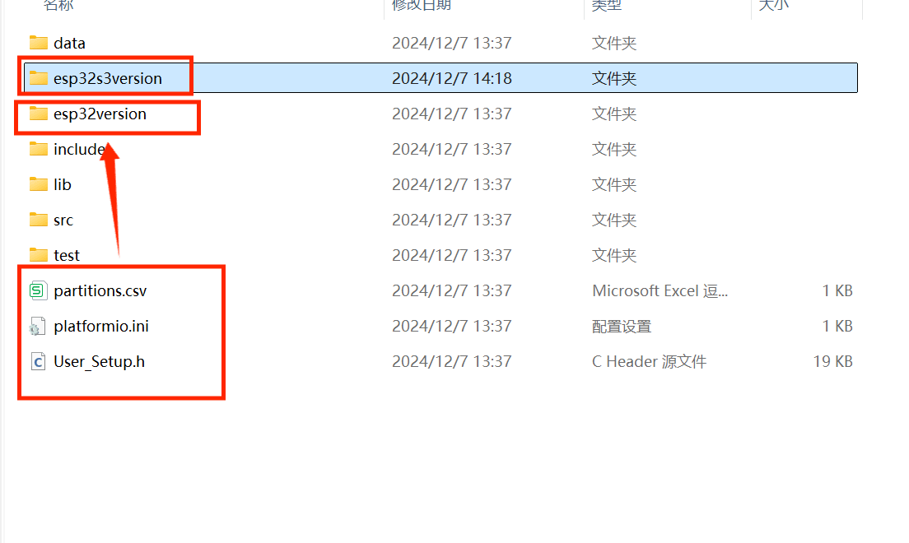

# ESP32_AI_LLM

## 目录
- [部署教程](#部署教程)
- [项目简介](#简介)
- [使用准备](#使用准备) 
- [硬件配置](#硬件配置)
- [功能介绍](#功能介绍)
- [项目成品图参考](#项目成品图参考)

## 部署教程
- 安装esp32的驱动，使用串口监视器进行测试，确保可以识别
- 下载配置vscode环境，安装platformIO插件，安装天问Block客户端软件
- 配置好asrpro模块
- 将所有元器件连接在一起
- 将项目克隆到本地，根据你使用的开发板将esp32AI_vscode文件夹下的如图所示的三个配置文件更换为对应的版本，然后在vscode中打开esp32AI_vscode文件夹，然后等待依赖库下载完毕（右下角的状态栏显示下载进度）

- 查看main.cpp顶部的注意事项，并进行对应的操作
- 开通讯飞相关服务，填写main.cpp中要求填写的讯飞账号参数，填写你想使用的大模型的相关参数
- 编译、烧录

## 简介
本项目基于ESP32实现了一个智能语音助手，主要特点：
- 支持多个大模型：ChatGPT、Claude、Gemini、Grok、Mistral、豆包大模型、月之暗面、通义千问、讯飞星火、腾讯混元、百川智能、BigModel、零一万物、DeepSeek、Ollama
- 语音交互：支持语音唤醒、连续对话
- 多功能：支持串口对话、音乐播放、抽象整活、显示屏实时显示等
- 便捷网页配置：支持网页配置WiFi、大模型参数等信息

## 使用准备

### 开通AI服务
1. 讯飞服务（必需）
   - 注册讯飞开放平台 (https://www.xfyun.cn)
   - 开通LLM大模型服务和STT语音转文字服务，参考Other/images文件夹中的配置截图

2. 其它大模型服务（可选）

### ASRPRO配置
下载天问Block（http://www.twen51.com/new/twen51/index.php），可以在浏览器搜索教程。
打开天问Block->个人中心（登录）->使用数据线连接asrpro设备，鼠标移至未连接，选择一键安装驱动，安装完成后，未连接会变成对应的驱动->项目（打开项目）->选择我这个项目的asrpro文件夹中的“esp32AI助手.hd”打开->修改你想要的唤醒词（默认：你好九歌）和打断命令词（默认：九歌）->点击生成模型，等待完成->点击2M编译下载

### 项目开发环境
使用vscode中的platformIO插件，天问Block

### 串口监视器推荐
https://serial.keysking.com
设置参考：

## 硬件配置

### 硬件清单
- ESP-WROOM-32 / ESP32-S3-N16R8
- INMP441全向麦克风
- MAX98357 I2S音频放大器
- 1.8寸RGB_TFT屏幕(128x160)
- ASRPRO开发板(2M/4M均可)
- 其他配件：喇叭、面包板、面包板跳线、数据线、led灯等

### 详细接线对照表

#### 1. INMP441麦克风模块
| 模块引脚 | ESP32连接 | ESP32-S3连接 |
|---------|-----------|--------------|
| VDD     | 3.3V      | 3.3V         |
| GND     | GND       | GND          |
| SD      | GPIO22    | GPIO42       |
| WS      | GPIO15    | GPIO1        |
| SCK     | GPIO4     | GPIO2        |

#### 2. MAX98357音频放大模块
| 模块引脚 | ESP32连接 | ESP32-S3连接 |
|---------|-----------|--------------|
| Vin     | VIN       | V5IN         |
| GND     | GND       | GND          |
| LRC     | GPIO27    | GPIO7        |
| BCLK    | GPIO26    | GPIO6        |
| DIN     | GPIO25    | GPIO5        |

#### 3. 1.8寸RGB_TFT屏幕
| 模块引脚 | ESP32连接 | ESP32-S3连接 |
|---------|-----------|--------------|
| VDD     | VIN       | V5IN         |
| GND     | GND       | GND          |
| SCL     | GPIO18    | GPIO12       |
| SDA     | GPIO23    | GPIO11       |
| RST     | GPIO12    | GPIO15       |
| DC      | GPIO32    | GPIO16       |
| CS      | GPIO5     | GPIO10       |

#### 4. ASRPRO模块
| 模块引脚 | ESP32连接    | ESP32-S3连接  |
|---------|-------------|---------------|
| 5V      | VIN         | V5IN          |
| GND     | GND         | GND           |
| PB5     | RX2(GPIO16) | RX2(GPIO19)   |
| PB6     | TX2(GPIO17) | TX2(GPIO20)   |
| PA2     | GPIO19      | GPIO3         |

#### 5. LED指示灯
| 引脚 | ESP32连接 | ESP32-S3连接 |
|------|-----------|--------------|
| 正极  | GPIO33    | GPIO38       |
| 负极  | GND       | GND          |

## 功能介绍

### 语音唤醒功能
- 在线唤醒（不使用ASRPRO）：设备启动连接网络后会直接进入待机状态，开启录音并连接讯飞的stt服务进行唤醒词识别，如果长时间不使用，请断开设备电源，防止讯飞stt服务量的大量耗费。唤醒词可在main.cpp的第1514行修改。（不推荐使用此方法）

- 离线唤醒（使用ASRPRO）：通过ASRPRO唤醒，识别到唤醒词时，通过PA2输出一个低电平信号给19引脚，进入对话。

### 语音对话功能

每次回答完毕后，会有提示音播放，提示音文件存储在esp32的SPIFFS中，存储方法：连接好esp32，然后依次点击图中指示的位置。

### 便捷配网功能
网络连接通过读取ESP32 flash的NVS中存储的Wi-Fi信息实现。设备启动后开始联网时，板载LED会闪烁，屏幕显示相应的连接状态信息。esp32处于无网状态时，ESP32启动AP模式，创建临时网络热点ESP32-Setup（初始密码为12345678）。手机或电脑连接此网络后，浏览器输入192.168.4.1，出现配置网页界面，通过该网页界面，即可进行网络的配置。

### 音乐播放功能
音乐播放白嫖了网易云的音乐服务器，通过如下的链接即可访问音乐文件（vip音乐不支持）。
https://music.163.com/song/media/outer/url?id=音乐数字id.mp3

音乐播放通过读取ESP32 flash的NVS中存储的音乐信息实现。esp32处于无网状态时，ESP32启动AP模式，创建临时网络热点ESP32-Setup（初始密码为12345678）。手机或电脑连接此网络后，浏览器输入192.168.4.1，出现配置网页界面，通过该网页界面，即可进行音乐信息的添加与删除。

需要注意的点：比较长的音乐名建议不要写全，因为stt不一定识别的出来，可能只能识别出一部分，然后就是尽量不要写英文名称，因为英文识别准确率太烂了。还有就是部分音乐播放到中间会重新开始播放，好像是网易云的问题。

### 音量调节和开关灯功能
通过相关的语音指令，可以实现音量的调节与显示，led灯的开关。在AI说话时，按下boot键说出调节音量和开关灯的指令，esp32做出对应的反应后会继续刚才没说完的话。

### 音乐暂停和恢复播放指令
在音乐正在播放时，按下boot键说出”暂停播放”指令，即可暂停播放，再按下boot键说出”恢复播放”指令，即可恢复播放。

### 大模型切换功能指令
在和AI进行对话时，通过说出“切换模型”指令（要具体的说出切换为第几个大模型或者大模型具体的名字），目前可以在15款大模型之间进行切换。

### 屏幕显示功能
使用一块1.8寸（128x160）RGB_TFT屏幕显示用户与大模型的对话内容等信息

### 抽象整活功能（在Dufs文件夹中）
开启dufs服务，配置好监听端口，esp32与开启dufs服务的设备需处于同一wifi下，使用唤醒词唤醒设备后，当设备处于待机状态或说话状态时，使用命令词丁真、坤坤、牢大即可触发对应的壁纸显示、语音和音乐。

### 其它指令
- 退下：进入待机状态（此时asrpro仍保持在唤醒状态），此时仍可识别命令词，一个小时内未识别到唤醒词asrpro退出唤醒状态，此时需要重新唤醒才可进行命令词的识别
- 再见、拜拜、休眠：asrpro退出唤醒状态，不可识别命令词

### 程序执行流程
setup初始化：
- 初始化串口通信、引脚配置、屏幕显示、录音模块Audio1、音频输出模块Audio2等。
- 调用wifiConnect()连接网络。
- 如果网络连接成功，加载nvs中存储的大模型参数，调用getTimeFromServer()从百度服务器获取当前日期和时间，然后调用getUrl()生成url和url1（分别用于星火大模型和语音识别的鉴权）。
- 如果网络连接失败，esp32启动热点和web服务器。

loop循环：
- 轮询处理WebSocket客户端消息，检查和处理从服务器接收的消息、发送等待发送的数据，维护与服务器的连接。
- 如果有多段语音需要播放，调用voiceplay()函数播放后续的语音。
- 调用audio2.loop()确保音频流的连续和稳定播放。
- 没有音频播放时，熄灭板载LED；有音频播放时，点亮板载LED。
- 进入待机模式，启动唤醒词识别，可在onMessageCallback1()中自定义唤醒词。
- 检测到板载boot按键被按下时，连接WebSocket服务器1（语音转文字）并开启录音，在8秒内没有说话就会结束本轮对话，然后进入待机模式，启动唤醒词识别。如果有说话，录音结束后调用讯飞STT服务API接口将语音转文本。如果文本内容为空，回复“对不起，我没有听清，可以再说一遍吗？”；不为空时连接WebSocket服务器（大模型），将文本发送给星火大模型（可选豆包大模型），然后接收大模型回复文本，并发送给百度的TTS服务转语音播放，同时在屏幕上显示对话内容。
- 检测到AI说话完毕后，自动连接WebSocket服务器1（语音转文字）并开启录音，后面的与上一条相同，实现连续对话功能。

## 项目成品图参考

> 本项目基于 [Esp32_VoiceChat_LLMs](https://github.com/MetaWu2077/Esp32_VoiceChat_LLMs) 改进开发
